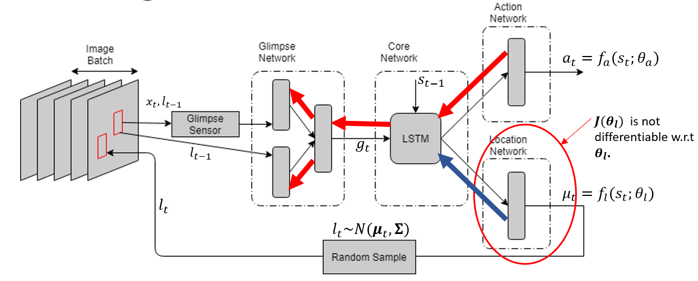

# Recurrent Attention Model for Image Classification
---
## Description
Convolutional Neural Network is proved to be an effective mechanism to perform object-classification task. Yet, it imposes tremendous computational overhead while processing the image as it needs to read entire image to emit the prediction. [(Mnih et al. 2014)](https://arxiv.org/pdf/1406.6247.pdf) developed a Recurrent Attention Model (RAM) mimicking the retina-like structure that focuses attention to only those parts of the image which provide maximum information to accomplish the classification task. As demonstrated by the authors, this model achieves considerable accuracy when tested on MNIST dataset in three different settings, namely, ‘Centered Digits’, ‘Non-Centered Digits’ and ‘Cluttered Non-Centered Digits’. In this project, I implement this model as it is and study the results.

## Architecture

The Recurrent Attention Model consists of
1. Glimpse Sensor
2. Glimpse Network
3. Core Network
4. Action Network
5. Location Network

### 1. Glimpse Sensor
Glimpse sensor resembles the structure of the retina of human eye. It produces a glimpse by reading patches of the image at specified location with successively decreasing resolutions.

### 2. Glimpse Network
Glimpse Network is a feedforward network that takes glimpse and its location as input and encodes it in 1-dimensional vector.

### 3. Core Network
Core network is a Recurrent Neural Network that takes glimpse-encoding(produced by Glimpse Network) and previous state as input and produces next state as output.

### 4. Action Network
Action Network is a fully connected layer followed by softmax activation. It takes the state produced by Core Network as input and emits probability of each class as ouotput. The class with maximum probability is the action taken by the agent.

### 5. Location Network
Location Network decides location of the next glimpse. It is a fully connected layer with linear activation that takes the state produced by Core Network as input and produces 2-dimensional output which is then used as the mean of Gaussian distribution over which the next location is sampled.

## Training

--
